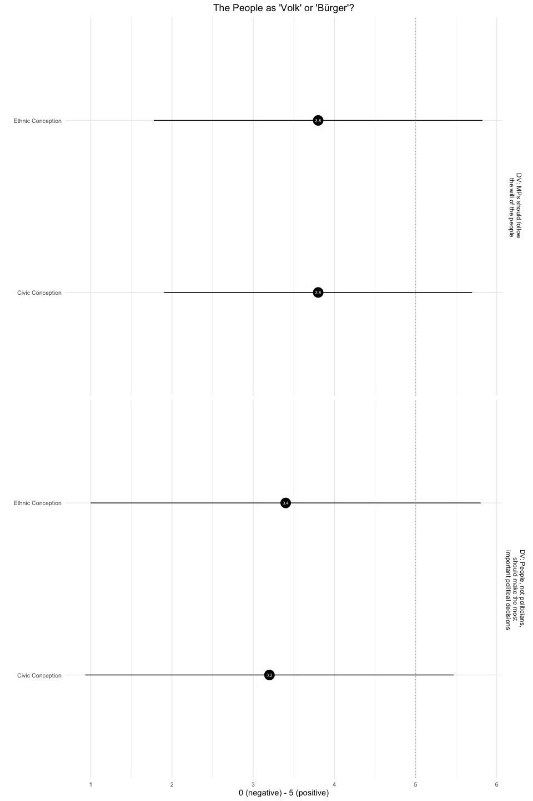
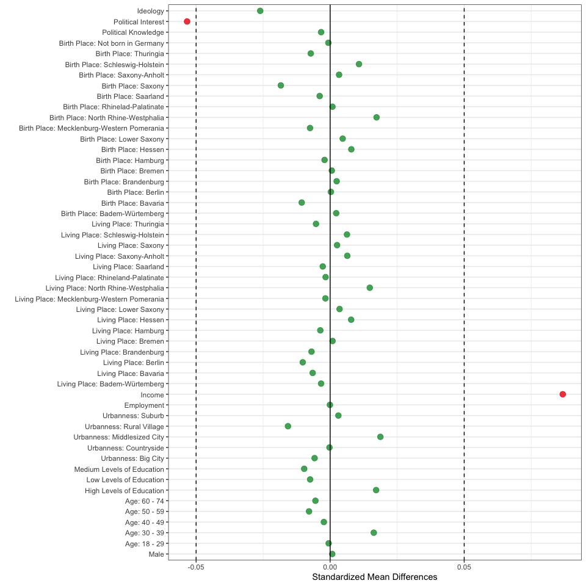
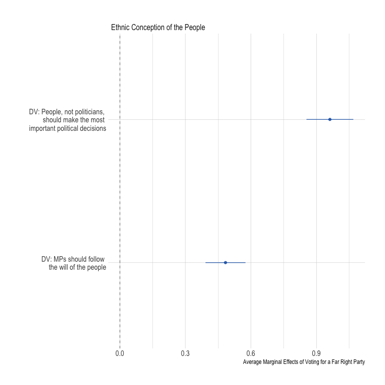

Analyses
================

# Scripts

  - [Required Packages &
    Reproducibility](#required-packages-&-reproducibility)
  - [Analyses](#analyses)
      - [Descriptive Results](#descriptive-results)
      - [Balance Checks](#balance-checks)
      - [Gender Hypothesis](#gender-hypothesis)
      - [Migration Hypothesis](#migration-hypothesis)
      - [Intersection Hypothesis](#intersection-hypothesis)
      - [Intersection Hypothesis –
        Pooled](#intersection-hypothesis--pooled)

# Required Packages & Reproducibility

``` r
rm(list=ls())
source(here::here("src/lib/functions.R"))
```

# Analyses

``` r
load(here("data/intermediate/cleaned_experiment.RData"))
source(here("src/analysis/data-for-analyses.R"))
```

Next, we automatically extract a `.md` file for the online appendix, as
well as a latex table for the manuscript. We are using jinja2 template
[src/analysis/table\_descriptives.tex.j2](table.tex.j2) which is called
with a json string containing the data. To replicate, make sure
`env/bin/pip install -U j2cli` is installed via your command line.

``` r
source(here("src/analysis/descriptive-information-overview.R"))
table2 <- knitr::kable(descr, digits=2)
fn <- here("report/figures/table_descriptives.tex")
cat("# Table: Descriptive Information of Variables under Study \n\n", file=fn)
cat(table2, file=fn, sep="\n", append=T)

methodnames <- setNames(as.list(descr$Variables), descr$Variables)
table <- purrr::map(descr, .f= ".") 
#render_j2(here("src/analysis/table_descriptives.tex.j2"), here("report/figures/table_descriptives.tex"),
#          data=list(data=table, methods=methodnames))
rm(descr, methodnames, table, fn, table2)
```

## Descriptive Results



## Balance Checks

The figure below shows that the data is unbalanced for the variables:
`Education`,`Income`, `Employment`, `Urbaness`, `Living Place`, `Birth
Place`, `Age`, `Political Knowledge`, `Political Interest`, and
`Ideology`. As described in the Pre-Analysis Plan (p.10), I will add
these covariates to the analyses as controls.

``` r
source(here("src/analysis/balance-test.R"))
df
```



## Ethnic Conception Hypothesis

``` r
source(here("src/analysis/h1.R"))
p1
```


## National Identity Hypothesis

``` r
source(here("src/analysis/h2a.R"))
p2a
```


## Far Right Party ID Hypothesis

``` r
source(here("src/analysis/h2b.R"))
p2b
```



## Exploration
