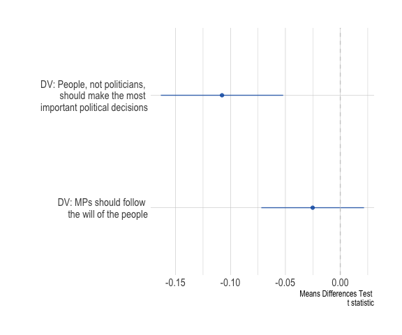
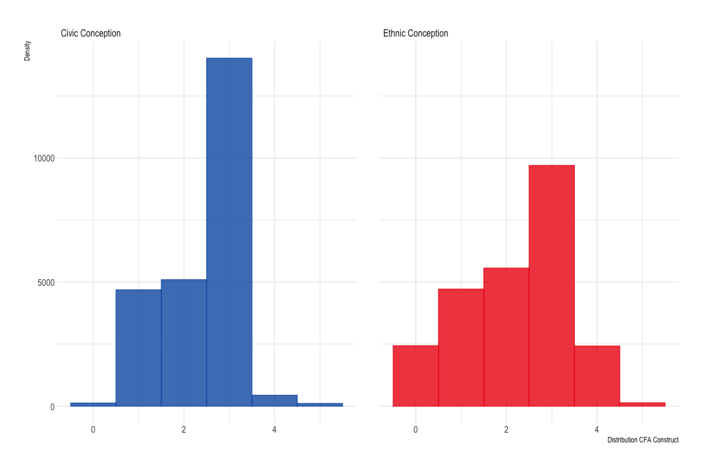

Analyses
================

# Scripts

# Required Packages & Reproducibility

``` r
rm(list=ls())
source(here::here("src/lib/functions.R"))
```

# Pre-Registered Analyses

``` r
load(here("data/intermediate/cleaned_experiment.RData"))
source(here("src/analysis/data-for-analyses.R"))
```

Next, we automatically extract a `.md` file for the online appendix, as
well as a latex table for the manuscript. We are using jinja2 template
[src/analysis/table_descriptives.tex.j2](table.tex.j2) which is called
with a json string containing the data. To replicate, make sure
`env/bin/pip install -U j2cli` is installed via your command line.

``` r
source(here("src/analysis/descriptive-information-overview.R"))
table2 <- knitr::kable(descr, digits=2)
fn <- here("report/figures/table_descriptives.tex")
cat("# Table: Descriptive Information of Variables under Study \n\n", file=fn)
cat(table2, file=fn, sep="\n", append=T)

methodnames <- setNames(as.list(descr$Variables), descr$Variables)
table <- purrr::map(descr, .f= ".") 
#render_j2(here("src/analysis/table_descriptives.tex.j2"), here("report/figures/table_descriptives.tex"),
#          data=list(data=table, methods=methodnames))
rm(descr, methodnames, table, fn, table2)
```

## Descriptive Results


## Balance Checks

The figure below shows that the data is unbalanced for the variables:
`Education`,`Income`, `Employment`, `Urbaness`, `Living Place`,
`Birth Place`, `Age`, `Political Knowledge`, `Political Interest`, and
`Ideology`. As described in the Pre-Analysis Plan (p.10), I will add
these covariates to the analyses as controls.

``` r
source(here("src/analysis/balance-test.R"))
df
```


## Ethnic Conception Hypothesis

``` r
source(here("src/analysis/h1.R"))
p1
```



``` r
# negative values: Ethnic conception > Civic conception 
# positive values: Ethnic conception < Civic conception

kbl(df, booktabs =T, caption = "Ethnic Conception Hypothesis - T-Test") %>%
  kable_styling(latex_options = c("striped", "hold_position"),
                full_width = F, fixed_thead = T, position = "center") %>%
  column_spec(1, width = "8cm") %>%
  column_spec(2, width = "2cm")  %>%
  column_spec(3, width = "2cm") %>%
  column_spec(4, width = "2cm") %>%
  column_spec(5, width = "2cm") %>%
  column_spec(6, width = "2cm")
```

<table class="table" style="width: auto !important; margin-left: auto; margin-right: auto;">
<caption>
Ethnic Conception Hypothesis - T-Test
</caption>
<thead>
<tr>
<th style="text-align:left;position: sticky; top:0; background-color: #FFFFFF;">
name
</th>
<th style="text-align:right;position: sticky; top:0; background-color: #FFFFFF;">
p_value
</th>
<th style="text-align:right;position: sticky; top:0; background-color: #FFFFFF;">
t_value
</th>
<th style="text-align:right;position: sticky; top:0; background-color: #FFFFFF;">
means_difference
</th>
<th style="text-align:right;position: sticky; top:0; background-color: #FFFFFF;">
lower
</th>
<th style="text-align:right;position: sticky; top:0; background-color: #FFFFFF;">
higher
</th>
</tr>
</thead>
<tbody>
<tr>
<td style="text-align:left;width: 8cm; ">
DV: People, not politicians, should make the most important political
decisions
</td>
<td style="text-align:right;width: 2cm; ">
0.00
</td>
<td style="text-align:right;width: 2cm; ">
-3.8
</td>
<td style="text-align:right;width: 2cm; ">
-0.11
</td>
<td style="text-align:right;width: 2cm; ">
-0.16
</td>
<td style="text-align:right;width: 2cm; ">
-0.05
</td>
</tr>
<tr>
<td style="text-align:left;width: 8cm; ">
DV: MPs should follow the will of the people
</td>
<td style="text-align:right;width: 2cm; ">
0.29
</td>
<td style="text-align:right;width: 2cm; ">
-1.1
</td>
<td style="text-align:right;width: 2cm; ">
-0.03
</td>
<td style="text-align:right;width: 2cm; ">
-0.07
</td>
<td style="text-align:right;width: 2cm; ">
0.02
</td>
</tr>
</tbody>
</table>

## National Identity Hypothesis

``` r
source(here("src/analysis/h2a.R"))
p2a
```


``` r
h2a <- h2a %>% 
  mutate(y = recode(y,
                    `POST_2` = "DV: People, not politicians, should make the most \n important political decisions",
                    `POST_3` = "DV: MPs should follow the will of the \n people",
                    `POST_4` = "DV: Differences between elites an the people are bigger than \n differences between the people")) %>%
  select(y, AME:lower, a) %>%
  rename(`Exclusive National Identity` = a)

kbl(h2a, booktabs =T, caption = "National Identity Hypothesis - AME") %>%
  kable_styling(latex_options = c("striped", "hold_position"),
                full_width = F, fixed_thead = T, position = "center") %>%
  column_spec(1, width = "8cm") %>%
  column_spec(2, width = "2cm")  %>%
  column_spec(3, width = "2cm") %>%
  column_spec(4, width = "2cm") %>%
  column_spec(5, width = "2cm") 
```

<table class="table" style="width: auto !important; margin-left: auto; margin-right: auto;">
<caption>
National Identity Hypothesis - AME
</caption>
<thead>
<tr>
<th style="text-align:left;position: sticky; top:0; background-color: #FFFFFF;">
y
</th>
<th style="text-align:right;position: sticky; top:0; background-color: #FFFFFF;">
AME
</th>
<th style="text-align:right;position: sticky; top:0; background-color: #FFFFFF;">
upper
</th>
<th style="text-align:right;position: sticky; top:0; background-color: #FFFFFF;">
lower
</th>
<th style="text-align:right;position: sticky; top:0; background-color: #FFFFFF;">
Exclusive National Identity
</th>
</tr>
</thead>
<tbody>
<tr>
<td style="text-align:left;width: 8cm; ">
DV: People, not politicians, should make the most important political
decisions
</td>
<td style="text-align:right;width: 2cm; ">
-0.08
</td>
<td style="text-align:right;width: 2cm; ">
0.06
</td>
<td style="text-align:right;width: 2cm; ">
-0.23
</td>
<td style="text-align:right;width: 2cm; ">
1
</td>
</tr>
<tr>
<td style="text-align:left;width: 8cm; ">
DV: People, not politicians, should make the most important political
decisions
</td>
<td style="text-align:right;width: 2cm; ">
-0.01
</td>
<td style="text-align:right;width: 2cm; ">
0.09
</td>
<td style="text-align:right;width: 2cm; ">
-0.10
</td>
<td style="text-align:right;width: 2cm; ">
2
</td>
</tr>
<tr>
<td style="text-align:left;width: 8cm; ">
DV: People, not politicians, should make the most important political
decisions
</td>
<td style="text-align:right;width: 2cm; ">
0.07
</td>
<td style="text-align:right;width: 2cm; ">
0.13
</td>
<td style="text-align:right;width: 2cm; ">
0.01
</td>
<td style="text-align:right;width: 2cm; ">
3
</td>
</tr>
<tr>
<td style="text-align:left;width: 8cm; ">
DV: People, not politicians, should make the most important political
decisions
</td>
<td style="text-align:right;width: 2cm; ">
0.15
</td>
<td style="text-align:right;width: 2cm; ">
0.20
</td>
<td style="text-align:right;width: 2cm; ">
0.10
</td>
<td style="text-align:right;width: 2cm; ">
4
</td>
</tr>
<tr>
<td style="text-align:left;width: 8cm; ">
DV: People, not politicians, should make the most important political
decisions
</td>
<td style="text-align:right;width: 2cm; ">
0.22
</td>
<td style="text-align:right;width: 2cm; ">
0.31
</td>
<td style="text-align:right;width: 2cm; ">
0.14
</td>
<td style="text-align:right;width: 2cm; ">
5
</td>
</tr>
<tr>
<td style="text-align:left;width: 8cm; ">
DV: MPs should follow the will of the people
</td>
<td style="text-align:right;width: 2cm; ">
-0.05
</td>
<td style="text-align:right;width: 2cm; ">
0.08
</td>
<td style="text-align:right;width: 2cm; ">
-0.17
</td>
<td style="text-align:right;width: 2cm; ">
1
</td>
</tr>
<tr>
<td style="text-align:left;width: 8cm; ">
DV: MPs should follow the will of the people
</td>
<td style="text-align:right;width: 2cm; ">
-0.02
</td>
<td style="text-align:right;width: 2cm; ">
0.06
</td>
<td style="text-align:right;width: 2cm; ">
-0.10
</td>
<td style="text-align:right;width: 2cm; ">
2
</td>
</tr>
<tr>
<td style="text-align:left;width: 8cm; ">
DV: MPs should follow the will of the people
</td>
<td style="text-align:right;width: 2cm; ">
0.01
</td>
<td style="text-align:right;width: 2cm; ">
0.06
</td>
<td style="text-align:right;width: 2cm; ">
-0.04
</td>
<td style="text-align:right;width: 2cm; ">
3
</td>
</tr>
<tr>
<td style="text-align:left;width: 8cm; ">
DV: MPs should follow the will of the people
</td>
<td style="text-align:right;width: 2cm; ">
0.03
</td>
<td style="text-align:right;width: 2cm; ">
0.08
</td>
<td style="text-align:right;width: 2cm; ">
-0.01
</td>
<td style="text-align:right;width: 2cm; ">
4
</td>
</tr>
<tr>
<td style="text-align:left;width: 8cm; ">
DV: MPs should follow the will of the people
</td>
<td style="text-align:right;width: 2cm; ">
0.06
</td>
<td style="text-align:right;width: 2cm; ">
0.13
</td>
<td style="text-align:right;width: 2cm; ">
-0.01
</td>
<td style="text-align:right;width: 2cm; ">
5
</td>
</tr>
</tbody>
</table>

## Far Right Party ID Hypothesis

``` r
source(here("src/analysis/h2b.R"))
p2b
```


``` r
h2b <- h2b %>% 
  mutate(y = recode(y,
                    `POST_2` = "DV: People, not politicians, should make the most \n important political decisions",
                    `POST_3` = "DV: MPs should follow the will of the \n people",
                    `POST_4` = "DV: Differences between elites an the people are bigger than \n differences between the people"),
         ethnic = recode(ethnic,
                         `1` = "Ethnic Conception of the People",
                         `0` = "Civic Conception")) %>%
  select(y, AME:lower, treatment = ethnic)

kbl(h2b, booktabs =T, caption = "Far Right Party ID - AME") %>%
  kable_styling(latex_options = c("striped", "hold_position"),
                full_width = F, fixed_thead = T, position = "center") %>%
  column_spec(1, width = "8cm") %>%
  column_spec(2, width = "2cm")  %>%
  column_spec(3, width = "2cm") %>%
  column_spec(4, width = "2cm") %>%
  column_spec(5, width = "2cm") 
```

<table class="table" style="width: auto !important; margin-left: auto; margin-right: auto;">
<caption>
Far Right Party ID - AME
</caption>
<thead>
<tr>
<th style="text-align:left;position: sticky; top:0; background-color: #FFFFFF;">
y
</th>
<th style="text-align:right;position: sticky; top:0; background-color: #FFFFFF;">
AME
</th>
<th style="text-align:right;position: sticky; top:0; background-color: #FFFFFF;">
upper
</th>
<th style="text-align:right;position: sticky; top:0; background-color: #FFFFFF;">
lower
</th>
<th style="text-align:left;position: sticky; top:0; background-color: #FFFFFF;">
treatment
</th>
</tr>
</thead>
<tbody>
<tr>
<td style="text-align:left;width: 8cm; ">
DV: People, not politicians, should make the most important political
decisions
</td>
<td style="text-align:right;width: 2cm; ">
0.85
</td>
<td style="text-align:right;width: 2cm; ">
0.95
</td>
<td style="text-align:right;width: 2cm; ">
0.74
</td>
<td style="text-align:left;width: 2cm; ">
Civic Conception
</td>
</tr>
<tr>
<td style="text-align:left;width: 8cm; ">
DV: People, not politicians, should make the most important political
decisions
</td>
<td style="text-align:right;width: 2cm; ">
0.96
</td>
<td style="text-align:right;width: 2cm; ">
1.07
</td>
<td style="text-align:right;width: 2cm; ">
0.85
</td>
<td style="text-align:left;width: 2cm; ">
Ethnic Conception of the People
</td>
</tr>
<tr>
<td style="text-align:left;width: 8cm; ">
DV: MPs should follow the will of the people
</td>
<td style="text-align:right;width: 2cm; ">
0.51
</td>
<td style="text-align:right;width: 2cm; ">
0.60
</td>
<td style="text-align:right;width: 2cm; ">
0.42
</td>
<td style="text-align:left;width: 2cm; ">
Civic Conception
</td>
</tr>
<tr>
<td style="text-align:left;width: 8cm; ">
DV: MPs should follow the will of the people
</td>
<td style="text-align:right;width: 2cm; ">
0.48
</td>
<td style="text-align:right;width: 2cm; ">
0.58
</td>
<td style="text-align:right;width: 2cm; ">
0.39
</td>
<td style="text-align:left;width: 2cm; ">
Ethnic Conception of the People
</td>
</tr>
</tbody>
</table>

# Exploration

``` r
source(here("src/analysis/explorative_analysis.R"))
pe1 
```


``` r
exp1 <- exp1 %>%
  mutate(y = recode(y,
                    `POST_2` = "DV: People, not politicians, \n should make the most \n important political decisions",
                    `POST_3` = "DV: MPs should follow \n the will of the people"))
kbl(exp1, booktabs =T, caption = "Ethnic Conception Hypothesis - OLS Effect of Ethnic Conception of the People ") %>%
  kable_styling(latex_options = c("striped", "hold_position"),
                full_width = F, fixed_thead = T, position = "center") %>%
  column_spec(1, width = "2cm") %>%
  column_spec(2, width = "2cm")  %>%
  column_spec(3, width = "2cm") %>%
  column_spec(4, width = "8cm")
```

<table class="table" style="width: auto !important; margin-left: auto; margin-right: auto;">
<caption>
Ethnic Conception Hypothesis - OLS Effect of Ethnic Conception of the
People
</caption>
<thead>
<tr>
<th style="text-align:right;position: sticky; top:0; background-color: #FFFFFF;">
estimate
</th>
<th style="text-align:right;position: sticky; top:0; background-color: #FFFFFF;">
upper
</th>
<th style="text-align:right;position: sticky; top:0; background-color: #FFFFFF;">
lower
</th>
<th style="text-align:left;position: sticky; top:0; background-color: #FFFFFF;">
y
</th>
</tr>
</thead>
<tbody>
<tr>
<td style="text-align:right;width: 2cm; ">
0.12
</td>
<td style="text-align:right;width: 2cm; ">
0.16
</td>
<td style="text-align:right;width: 2cm; ">
0.07
</td>
<td style="text-align:left;width: 8cm; ">
DV: People, not politicians, should make the most important political
decisions
</td>
</tr>
<tr>
<td style="text-align:right;width: 2cm; ">
0.02
</td>
<td style="text-align:right;width: 2cm; ">
0.06
</td>
<td style="text-align:right;width: 2cm; ">
-0.02
</td>
<td style="text-align:left;width: 8cm; ">
DV: MPs should follow the will of the people
</td>
</tr>
</tbody>
</table>

``` r
#(pe2 + pe3)/ (pe4 + pe5)
```

## Scaling fit

### CFA

``` r
source(here("src/analysis/explorative_cfa.R"))

kbl(m_cfa, booktabs =T, caption = "Confirmatory Factor Analysis - Fit Statistics") %>%
  kable_styling(latex_options = c("striped", "hold_position"),
                full_width = F, fixed_thead = T, position = "center") %>%
  column_spec(1, width = "4cm") %>%
  column_spec(2, width = "4cm")  %>%
  column_spec(3, width = "4cm") %>%
  column_spec(4, width = "4cm") 
```

<table class="table" style="width: auto !important; margin-left: auto; margin-right: auto;">
<caption>
Confirmatory Factor Analysis - Fit Statistics
</caption>
<thead>
<tr>
<th style="text-align:left;position: sticky; top:0; background-color: #FFFFFF;">
Fit Statistics
</th>
<th style="text-align:right;position: sticky; top:0; background-color: #FFFFFF;">
Ethnic Conception
</th>
<th style="text-align:right;position: sticky; top:0; background-color: #FFFFFF;">
Civic Conception
</th>
<th style="text-align:right;position: sticky; top:0; background-color: #FFFFFF;">
Civic Conception (6 Items)
</th>
</tr>
</thead>
<tbody>
<tr>
<td style="text-align:left;width: 4cm; ">
CFI
</td>
<td style="text-align:right;width: 4cm; ">
0.99
</td>
<td style="text-align:right;width: 4cm; ">
0.99
</td>
<td style="text-align:right;width: 4cm; ">
0.98
</td>
</tr>
<tr>
<td style="text-align:left;width: 4cm; ">
AIC
</td>
<td style="text-align:right;width: 4cm; ">
46486.08
</td>
<td style="text-align:right;width: 4cm; ">
45622.01
</td>
<td style="text-align:right;width: 4cm; ">
54614.40
</td>
</tr>
<tr>
<td style="text-align:left;width: 4cm; ">
BIC
</td>
<td style="text-align:right;width: 4cm; ">
46560.03
</td>
<td style="text-align:right;width: 4cm; ">
45696.02
</td>
<td style="text-align:right;width: 4cm; ">
54700.76
</td>
</tr>
<tr>
<td style="text-align:left;width: 4cm; ">
RMSEA
</td>
<td style="text-align:right;width: 4cm; ">
0.06
</td>
<td style="text-align:right;width: 4cm; ">
0.09
</td>
<td style="text-align:right;width: 4cm; ">
0.08
</td>
</tr>
<tr>
<td style="text-align:left;width: 4cm; ">
p-value RMSEA
</td>
<td style="text-align:right;width: 4cm; ">
0.13
</td>
<td style="text-align:right;width: 4cm; ">
0.00
</td>
<td style="text-align:right;width: 4cm; ">
0.00
</td>
</tr>
<tr>
<td style="text-align:left;width: 4cm; ">
SRMR
</td>
<td style="text-align:right;width: 4cm; ">
0.01
</td>
<td style="text-align:right;width: 4cm; ">
0.02
</td>
<td style="text-align:right;width: 4cm; ">
0.03
</td>
</tr>
</tbody>
</table>

``` r
kbl(cfa1, booktabs =T, caption = "Confirmatory Factor Analysis") %>%
  kable_styling(latex_options = c("striped", "hold_position"),
                full_width = F, fixed_thead = T, position = "center") %>%
  column_spec(1, width = "10cm") %>%
  column_spec(2, width = "3cm") 
```

<table class="table" style="width: auto !important; margin-left: auto; margin-right: auto;">
<caption>
Confirmatory Factor Analysis
</caption>
<thead>
<tr>
<th style="text-align:left;position: sticky; top:0; background-color: #FFFFFF;">
Variables
</th>
<th style="text-align:right;position: sticky; top:0; background-color: #FFFFFF;">
Values
</th>
</tr>
</thead>
<tbody>
<tr>
<td style="text-align:left;width: 10cm; ">
Average of PCA Constructed Scale for Civic Conception of the People
</td>
<td style="text-align:right;width: 3cm; ">
0.06
</td>
</tr>
<tr>
<td style="text-align:left;width: 10cm; ">
Average of PCA Constructed Scale for Ethnic Conception of the People
</td>
<td style="text-align:right;width: 3cm; ">
-0.38
</td>
</tr>
<tr>
<td style="text-align:left;width: 10cm; ">
Average of Civic Conception - Average of Ethnic Conception
</td>
<td style="text-align:right;width: 3cm; ">
0.44
</td>
</tr>
<tr>
<td style="text-align:left;width: 10cm; ">
p-Value for Differences in Means
</td>
<td style="text-align:right;width: 3cm; ">
0.00
</td>
</tr>
</tbody>
</table>

``` r
cfa2
```


### Additive scale

``` r
source(here("src/analysis/additive-scale.R"))

kbl(add1, booktabs =T, caption = "Addative Scaling Analysis") %>%
  kable_styling(latex_options = c("striped", "hold_position"),
                full_width = F, fixed_thead = T, position = "center") %>%
  column_spec(1, width = "10cm") %>%
  column_spec(2, width = "3cm")  
```

<table class="table" style="width: auto !important; margin-left: auto; margin-right: auto;">
<caption>
Addative Scaling Analysis
</caption>
<thead>
<tr>
<th style="text-align:left;position: sticky; top:0; background-color: #FFFFFF;">
Variables
</th>
<th style="text-align:right;position: sticky; top:0; background-color: #FFFFFF;">
Values
</th>
</tr>
</thead>
<tbody>
<tr>
<td style="text-align:left;width: 10cm; ">
Average of PCA Constructed Scale for Civic Conception of the People
</td>
<td style="text-align:right;width: 3cm; ">
3.40
</td>
</tr>
<tr>
<td style="text-align:left;width: 10cm; ">
Average of PCA Constructed Scale for Ethnic Conception of the People
</td>
<td style="text-align:right;width: 3cm; ">
3.28
</td>
</tr>
<tr>
<td style="text-align:left;width: 10cm; ">
Average of Civic Conception - Average of Ethnic Conception
</td>
<td style="text-align:right;width: 3cm; ">
0.11
</td>
</tr>
<tr>
<td style="text-align:left;width: 10cm; ">
p-Value for Differences in Means
</td>
<td style="text-align:right;width: 3cm; ">
0.00
</td>
</tr>
</tbody>
</table>

``` r
add2
```


### Wüttke et al. Approach

``` r
source(here("src/analysis/wuttke-approach.R"))

kbl(wa1, booktabs =T, caption = "Wüttke et al. Approach") %>%
  kable_styling(latex_options = c("striped", "hold_position"),
                full_width = F, fixed_thead = T, position = "center") %>%
  column_spec(1, width = "10cm") %>%
  column_spec(2, width = "3cm")  
```

<table class="table" style="width: auto !important; margin-left: auto; margin-right: auto;">
<caption>
Wüttke et al. Approach
</caption>
<thead>
<tr>
<th style="text-align:left;position: sticky; top:0; background-color: #FFFFFF;">
Variables
</th>
<th style="text-align:right;position: sticky; top:0; background-color: #FFFFFF;">
Values
</th>
</tr>
</thead>
<tbody>
<tr>
<td style="text-align:left;width: 10cm; ">
Average of PCA Constructed Scale for Civic Conception of the People
</td>
<td style="text-align:right;width: 3cm; ">
2.42
</td>
</tr>
<tr>
<td style="text-align:left;width: 10cm; ">
Average of PCA Constructed Scale for Ethnic Conception of the People
</td>
<td style="text-align:right;width: 3cm; ">
2.21
</td>
</tr>
<tr>
<td style="text-align:left;width: 10cm; ">
Average of Civic Conception - Average of Ethnic Conception
</td>
<td style="text-align:right;width: 3cm; ">
0.21
</td>
</tr>
<tr>
<td style="text-align:left;width: 10cm; ">
p-Value for Differences in Means
</td>
<td style="text-align:right;width: 3cm; ">
0.00
</td>
</tr>
</tbody>
</table>

``` r
wa2
```



### IRT Analyse

``` r
source(here("src/analysis/IRT.R"))
```

``` r
irt1 + irt2 + 
  plot_layout(widths = c(1, 2))
```


``` r
kbl(irt3, booktabs =T, caption = "IRT Analysis") %>%
  kable_styling(latex_options = c("striped", "hold_position"),
                full_width = F, fixed_thead = T, position = "center") %>%
  column_spec(1, width = "10cm") %>%
  column_spec(2, width = "3cm")  
```

<table class="table" style="width: auto !important; margin-left: auto; margin-right: auto;">
<caption>
IRT Analysis
</caption>
<thead>
<tr>
<th style="text-align:left;position: sticky; top:0; background-color: #FFFFFF;">
Variables
</th>
<th style="text-align:right;position: sticky; top:0; background-color: #FFFFFF;">
Values
</th>
</tr>
</thead>
<tbody>
<tr>
<td style="text-align:left;width: 10cm; ">
Average of IRT Constructed Scale for Civic Conception of the People
</td>
<td style="text-align:right;width: 3cm; ">
-0.01
</td>
</tr>
<tr>
<td style="text-align:left;width: 10cm; ">
Average of IRT Constructed Scale for Ethnic Conception of the People
</td>
<td style="text-align:right;width: 3cm; ">
0.00
</td>
</tr>
<tr>
<td style="text-align:left;width: 10cm; ">
Average of Civic Conception - Average of Ethnic Conception
</td>
<td style="text-align:right;width: 3cm; ">
-0.01
</td>
</tr>
<tr>
<td style="text-align:left;width: 10cm; ">
p-Value for Differences in Means
</td>
<td style="text-align:right;width: 3cm; ">
0.58
</td>
</tr>
</tbody>
</table>

``` r
irt4
```


## Explanatory Power: Predicting Populist Vote

``` r
source(here("src/analysis/predict-pop-vote-scales.R"))
exp1
```


``` r
exp <- exp %>%
  dplyr::select(estimate, lower, upper, scale = id, treatment = ethnic, y)
kbl(exp, booktabs =T, caption = "Explanatory Power: Scales Predicting Populist Vote - OLS Regression") %>%
  kable_styling(latex_options = c("striped", "hold_position"),
                full_width = F, fixed_thead = T, position = "center") %>%
  column_spec(1, width = "2cm") %>%
  column_spec(2, width = "2cm")  %>%
  column_spec(3, width = "2cm") %>%
  column_spec(4, width = "4cm") %>%
  column_spec(5, width = "4cm") %>%
  column_spec(6, width = "4cm")
```

<table class="table" style="width: auto !important; margin-left: auto; margin-right: auto;">
<caption>
Explanatory Power: Scales Predicting Populist Vote - OLS Regression
</caption>
<thead>
<tr>
<th style="text-align:right;position: sticky; top:0; background-color: #FFFFFF;">
estimate
</th>
<th style="text-align:right;position: sticky; top:0; background-color: #FFFFFF;">
lower
</th>
<th style="text-align:right;position: sticky; top:0; background-color: #FFFFFF;">
upper
</th>
<th style="text-align:left;position: sticky; top:0; background-color: #FFFFFF;">
scale
</th>
<th style="text-align:left;position: sticky; top:0; background-color: #FFFFFF;">
treatment
</th>
<th style="text-align:left;position: sticky; top:0; background-color: #FFFFFF;">
y
</th>
</tr>
</thead>
<tbody>
<tr>
<td style="text-align:right;width: 2cm; ">
0.12
</td>
<td style="text-align:right;width: 2cm; ">
0.10
</td>
<td style="text-align:right;width: 2cm; ">
0.14
</td>
<td style="text-align:left;width: 4cm; ">
CFA Scaling
</td>
<td style="text-align:left;width: 4cm; ">
Civic Conception
</td>
<td style="text-align:left;width: 4cm; ">
Voted: Populist Party
</td>
</tr>
<tr>
<td style="text-align:right;width: 2cm; ">
0.10
</td>
<td style="text-align:right;width: 2cm; ">
0.09
</td>
<td style="text-align:right;width: 2cm; ">
0.12
</td>
<td style="text-align:left;width: 4cm; ">
CFA Scaling
</td>
<td style="text-align:left;width: 4cm; ">
Civic Conception
</td>
<td style="text-align:left;width: 4cm; ">
Voted: AfD
</td>
</tr>
<tr>
<td style="text-align:right;width: 2cm; ">
0.02
</td>
<td style="text-align:right;width: 2cm; ">
0.00
</td>
<td style="text-align:right;width: 2cm; ">
0.03
</td>
<td style="text-align:left;width: 4cm; ">
CFA Scaling
</td>
<td style="text-align:left;width: 4cm; ">
Civic Conception
</td>
<td style="text-align:left;width: 4cm; ">
Voted: Left
</td>
</tr>
<tr>
<td style="text-align:right;width: 2cm; ">
0.08
</td>
<td style="text-align:right;width: 2cm; ">
0.06
</td>
<td style="text-align:right;width: 2cm; ">
0.09
</td>
<td style="text-align:left;width: 4cm; ">
CFA Scaling
</td>
<td style="text-align:left;width: 4cm; ">
Ethnic Conception
</td>
<td style="text-align:left;width: 4cm; ">
Voted: Populist Party
</td>
</tr>
<tr>
<td style="text-align:right;width: 2cm; ">
0.07
</td>
<td style="text-align:right;width: 2cm; ">
0.06
</td>
<td style="text-align:right;width: 2cm; ">
0.08
</td>
<td style="text-align:left;width: 4cm; ">
CFA Scaling
</td>
<td style="text-align:left;width: 4cm; ">
Ethnic Conception
</td>
<td style="text-align:left;width: 4cm; ">
Voted: AfD
</td>
</tr>
<tr>
<td style="text-align:right;width: 2cm; ">
0.01
</td>
<td style="text-align:right;width: 2cm; ">
-0.01
</td>
<td style="text-align:right;width: 2cm; ">
0.02
</td>
<td style="text-align:left;width: 4cm; ">
CFA Scaling
</td>
<td style="text-align:left;width: 4cm; ">
Ethnic Conception
</td>
<td style="text-align:left;width: 4cm; ">
Voted: Left
</td>
</tr>
<tr>
<td style="text-align:right;width: 2cm; ">
0.08
</td>
<td style="text-align:right;width: 2cm; ">
0.07
</td>
<td style="text-align:right;width: 2cm; ">
0.10
</td>
<td style="text-align:left;width: 4cm; ">
Addative Scale
</td>
<td style="text-align:left;width: 4cm; ">
Civic Conception
</td>
<td style="text-align:left;width: 4cm; ">
Voted: Populist Party
</td>
</tr>
<tr>
<td style="text-align:right;width: 2cm; ">
0.07
</td>
<td style="text-align:right;width: 2cm; ">
0.06
</td>
<td style="text-align:right;width: 2cm; ">
0.09
</td>
<td style="text-align:left;width: 4cm; ">
Addative Scale
</td>
<td style="text-align:left;width: 4cm; ">
Civic Conception
</td>
<td style="text-align:left;width: 4cm; ">
Voted: AfD
</td>
</tr>
<tr>
<td style="text-align:right;width: 2cm; ">
0.01
</td>
<td style="text-align:right;width: 2cm; ">
0.00
</td>
<td style="text-align:right;width: 2cm; ">
0.02
</td>
<td style="text-align:left;width: 4cm; ">
Addative Scale
</td>
<td style="text-align:left;width: 4cm; ">
Civic Conception
</td>
<td style="text-align:left;width: 4cm; ">
Voted: Left
</td>
</tr>
<tr>
<td style="text-align:right;width: 2cm; ">
0.06
</td>
<td style="text-align:right;width: 2cm; ">
0.05
</td>
<td style="text-align:right;width: 2cm; ">
0.07
</td>
<td style="text-align:left;width: 4cm; ">
Addative Scale
</td>
<td style="text-align:left;width: 4cm; ">
Ethnic Conception
</td>
<td style="text-align:left;width: 4cm; ">
Voted: Populist Party
</td>
</tr>
<tr>
<td style="text-align:right;width: 2cm; ">
0.05
</td>
<td style="text-align:right;width: 2cm; ">
0.05
</td>
<td style="text-align:right;width: 2cm; ">
0.06
</td>
<td style="text-align:left;width: 4cm; ">
Addative Scale
</td>
<td style="text-align:left;width: 4cm; ">
Ethnic Conception
</td>
<td style="text-align:left;width: 4cm; ">
Voted: AfD
</td>
</tr>
<tr>
<td style="text-align:right;width: 2cm; ">
0.01
</td>
<td style="text-align:right;width: 2cm; ">
0.00
</td>
<td style="text-align:right;width: 2cm; ">
0.02
</td>
<td style="text-align:left;width: 4cm; ">
Addative Scale
</td>
<td style="text-align:left;width: 4cm; ">
Ethnic Conception
</td>
<td style="text-align:left;width: 4cm; ">
Voted: Left
</td>
</tr>
<tr>
<td style="text-align:right;width: 2cm; ">
0.06
</td>
<td style="text-align:right;width: 2cm; ">
0.05
</td>
<td style="text-align:right;width: 2cm; ">
0.08
</td>
<td style="text-align:left;width: 4cm; ">
Wüttke et al. Approach
</td>
<td style="text-align:left;width: 4cm; ">
Civic Conception
</td>
<td style="text-align:left;width: 4cm; ">
Voted: Populist Party
</td>
</tr>
<tr>
<td style="text-align:right;width: 2cm; ">
0.06
</td>
<td style="text-align:right;width: 2cm; ">
0.05
</td>
<td style="text-align:right;width: 2cm; ">
0.07
</td>
<td style="text-align:left;width: 4cm; ">
Wüttke et al. Approach
</td>
<td style="text-align:left;width: 4cm; ">
Civic Conception
</td>
<td style="text-align:left;width: 4cm; ">
Voted: AfD
</td>
</tr>
<tr>
<td style="text-align:right;width: 2cm; ">
0.01
</td>
<td style="text-align:right;width: 2cm; ">
0.00
</td>
<td style="text-align:right;width: 2cm; ">
0.02
</td>
<td style="text-align:left;width: 4cm; ">
Wüttke et al. Approach
</td>
<td style="text-align:left;width: 4cm; ">
Civic Conception
</td>
<td style="text-align:left;width: 4cm; ">
Voted: Left
</td>
</tr>
<tr>
<td style="text-align:right;width: 2cm; ">
0.05
</td>
<td style="text-align:right;width: 2cm; ">
0.04
</td>
<td style="text-align:right;width: 2cm; ">
0.06
</td>
<td style="text-align:left;width: 4cm; ">
Wüttke et al. Approach
</td>
<td style="text-align:left;width: 4cm; ">
Ethnic Conception
</td>
<td style="text-align:left;width: 4cm; ">
Voted: Populist Party
</td>
</tr>
<tr>
<td style="text-align:right;width: 2cm; ">
0.05
</td>
<td style="text-align:right;width: 2cm; ">
0.04
</td>
<td style="text-align:right;width: 2cm; ">
0.06
</td>
<td style="text-align:left;width: 4cm; ">
Wüttke et al. Approach
</td>
<td style="text-align:left;width: 4cm; ">
Ethnic Conception
</td>
<td style="text-align:left;width: 4cm; ">
Voted: AfD
</td>
</tr>
<tr>
<td style="text-align:right;width: 2cm; ">
0.00
</td>
<td style="text-align:right;width: 2cm; ">
-0.01
</td>
<td style="text-align:right;width: 2cm; ">
0.01
</td>
<td style="text-align:left;width: 4cm; ">
Wüttke et al. Approach
</td>
<td style="text-align:left;width: 4cm; ">
Ethnic Conception
</td>
<td style="text-align:left;width: 4cm; ">
Voted: Left
</td>
</tr>
<tr>
<td style="text-align:right;width: 2cm; ">
0.07
</td>
<td style="text-align:right;width: 2cm; ">
0.06
</td>
<td style="text-align:right;width: 2cm; ">
0.09
</td>
<td style="text-align:left;width: 4cm; ">
IRT Scaling
</td>
<td style="text-align:left;width: 4cm; ">
Civic Conception
</td>
<td style="text-align:left;width: 4cm; ">
Voted: Populist Party
</td>
</tr>
<tr>
<td style="text-align:right;width: 2cm; ">
0.06
</td>
<td style="text-align:right;width: 2cm; ">
0.05
</td>
<td style="text-align:right;width: 2cm; ">
0.07
</td>
<td style="text-align:left;width: 4cm; ">
IRT Scaling
</td>
<td style="text-align:left;width: 4cm; ">
Civic Conception
</td>
<td style="text-align:left;width: 4cm; ">
Voted: AfD
</td>
</tr>
<tr>
<td style="text-align:right;width: 2cm; ">
0.01
</td>
<td style="text-align:right;width: 2cm; ">
0.00
</td>
<td style="text-align:right;width: 2cm; ">
0.02
</td>
<td style="text-align:left;width: 4cm; ">
IRT Scaling
</td>
<td style="text-align:left;width: 4cm; ">
Civic Conception
</td>
<td style="text-align:left;width: 4cm; ">
Voted: Left
</td>
</tr>
<tr>
<td style="text-align:right;width: 2cm; ">
0.07
</td>
<td style="text-align:right;width: 2cm; ">
0.06
</td>
<td style="text-align:right;width: 2cm; ">
0.08
</td>
<td style="text-align:left;width: 4cm; ">
IRT Scaling
</td>
<td style="text-align:left;width: 4cm; ">
Ethnic Conception
</td>
<td style="text-align:left;width: 4cm; ">
Voted: Populist Party
</td>
</tr>
<tr>
<td style="text-align:right;width: 2cm; ">
0.06
</td>
<td style="text-align:right;width: 2cm; ">
0.05
</td>
<td style="text-align:right;width: 2cm; ">
0.07
</td>
<td style="text-align:left;width: 4cm; ">
IRT Scaling
</td>
<td style="text-align:left;width: 4cm; ">
Ethnic Conception
</td>
<td style="text-align:left;width: 4cm; ">
Voted: AfD
</td>
</tr>
<tr>
<td style="text-align:right;width: 2cm; ">
0.00
</td>
<td style="text-align:right;width: 2cm; ">
-0.01
</td>
<td style="text-align:right;width: 2cm; ">
0.02
</td>
<td style="text-align:left;width: 4cm; ">
IRT Scaling
</td>
<td style="text-align:left;width: 4cm; ">
Ethnic Conception
</td>
<td style="text-align:left;width: 4cm; ">
Voted: Left
</td>
</tr>
</tbody>
</table>

``` r
source(here("src/analysis/predict-pop-vote-items.R"))
exp1
```


``` r
exp <- exp %>%
  dplyr::select(estimate, lower, upper, item = id, treatment = ethnic, y)
kbl(exp, booktabs =T, caption = "Explanatory Power: Items Predicting Populist Vote - OLS Regression") %>%
  kable_styling(latex_options = c("striped", "hold_position"),
                full_width = F, fixed_thead = T, position = "center") %>%
  column_spec(1, width = "2cm") %>%
  column_spec(2, width = "2cm")  %>%
  column_spec(3, width = "2cm") %>%
  column_spec(4, width = "4cm") %>%
  column_spec(5, width = "4cm") %>%
  column_spec(6, width = "4cm")
```

<table class="table" style="width: auto !important; margin-left: auto; margin-right: auto;">
<caption>
Explanatory Power: Items Predicting Populist Vote - OLS Regression
</caption>
<thead>
<tr>
<th style="text-align:right;position: sticky; top:0; background-color: #FFFFFF;">
estimate
</th>
<th style="text-align:right;position: sticky; top:0; background-color: #FFFFFF;">
lower
</th>
<th style="text-align:right;position: sticky; top:0; background-color: #FFFFFF;">
upper
</th>
<th style="text-align:left;position: sticky; top:0; background-color: #FFFFFF;">
item
</th>
<th style="text-align:left;position: sticky; top:0; background-color: #FFFFFF;">
treatment
</th>
<th style="text-align:left;position: sticky; top:0; background-color: #FFFFFF;">
y
</th>
</tr>
</thead>
<tbody>
<tr>
<td style="text-align:right;width: 2cm; ">
0.04
</td>
<td style="text-align:right;width: 2cm; ">
0.03
</td>
<td style="text-align:right;width: 2cm; ">
0.05
</td>
<td style="text-align:left;width: 4cm; ">
Item 1 - Compromise is selling out
</td>
<td style="text-align:left;width: 4cm; ">
Ethnic Conception
</td>
<td style="text-align:left;width: 4cm; ">
Voted: Populist Party
</td>
</tr>
<tr>
<td style="text-align:right;width: 2cm; ">
0.04
</td>
<td style="text-align:right;width: 2cm; ">
0.03
</td>
<td style="text-align:right;width: 2cm; ">
0.05
</td>
<td style="text-align:left;width: 4cm; ">
Item 1 - Compromise is selling out
</td>
<td style="text-align:left;width: 4cm; ">
Ethnic Conception
</td>
<td style="text-align:left;width: 4cm; ">
Voted: AfD
</td>
</tr>
<tr>
<td style="text-align:right;width: 2cm; ">
0.00
</td>
<td style="text-align:right;width: 2cm; ">
-0.01
</td>
<td style="text-align:right;width: 2cm; ">
0.01
</td>
<td style="text-align:left;width: 4cm; ">
Item 1 - Compromise is selling out
</td>
<td style="text-align:left;width: 4cm; ">
Ethnic Conception
</td>
<td style="text-align:left;width: 4cm; ">
Voted: Left
</td>
</tr>
<tr>
<td style="text-align:right;width: 2cm; ">
0.05
</td>
<td style="text-align:right;width: 2cm; ">
0.04
</td>
<td style="text-align:right;width: 2cm; ">
0.06
</td>
<td style="text-align:left;width: 4cm; ">
Item 2 - The people must decide
</td>
<td style="text-align:left;width: 4cm; ">
Civic Conception
</td>
<td style="text-align:left;width: 4cm; ">
Voted: Populist Party
</td>
</tr>
<tr>
<td style="text-align:right;width: 2cm; ">
0.04
</td>
<td style="text-align:right;width: 2cm; ">
0.03
</td>
<td style="text-align:right;width: 2cm; ">
0.05
</td>
<td style="text-align:left;width: 4cm; ">
Item 2 - The people must decide
</td>
<td style="text-align:left;width: 4cm; ">
Civic Conception
</td>
<td style="text-align:left;width: 4cm; ">
Voted: AfD
</td>
</tr>
<tr>
<td style="text-align:right;width: 2cm; ">
0.01
</td>
<td style="text-align:right;width: 2cm; ">
0.00
</td>
<td style="text-align:right;width: 2cm; ">
0.02
</td>
<td style="text-align:left;width: 4cm; ">
Item 2 - The people must decide
</td>
<td style="text-align:left;width: 4cm; ">
Civic Conception
</td>
<td style="text-align:left;width: 4cm; ">
Voted: Left
</td>
</tr>
<tr>
<td style="text-align:right;width: 2cm; ">
0.04
</td>
<td style="text-align:right;width: 2cm; ">
0.04
</td>
<td style="text-align:right;width: 2cm; ">
0.05
</td>
<td style="text-align:left;width: 4cm; ">
Item 2 - The people must decide
</td>
<td style="text-align:left;width: 4cm; ">
Ethnic Conception
</td>
<td style="text-align:left;width: 4cm; ">
Voted: Populist Party
</td>
</tr>
<tr>
<td style="text-align:right;width: 2cm; ">
0.04
</td>
<td style="text-align:right;width: 2cm; ">
0.03
</td>
<td style="text-align:right;width: 2cm; ">
0.05
</td>
<td style="text-align:left;width: 4cm; ">
Item 2 - The people must decide
</td>
<td style="text-align:left;width: 4cm; ">
Ethnic Conception
</td>
<td style="text-align:left;width: 4cm; ">
Voted: AfD
</td>
</tr>
<tr>
<td style="text-align:right;width: 2cm; ">
0.00
</td>
<td style="text-align:right;width: 2cm; ">
0.00
</td>
<td style="text-align:right;width: 2cm; ">
0.01
</td>
<td style="text-align:left;width: 4cm; ">
Item 2 - The people must decide
</td>
<td style="text-align:left;width: 4cm; ">
Ethnic Conception
</td>
<td style="text-align:left;width: 4cm; ">
Voted: Left
</td>
</tr>
<tr>
<td style="text-align:right;width: 2cm; ">
0.05
</td>
<td style="text-align:right;width: 2cm; ">
0.03
</td>
<td style="text-align:right;width: 2cm; ">
0.06
</td>
<td style="text-align:left;width: 4cm; ">
Item 3 - Follow will of the peopl
</td>
<td style="text-align:left;width: 4cm; ">
Civic Conception
</td>
<td style="text-align:left;width: 4cm; ">
Voted: Populist Party
</td>
</tr>
<tr>
<td style="text-align:right;width: 2cm; ">
0.05
</td>
<td style="text-align:right;width: 2cm; ">
0.04
</td>
<td style="text-align:right;width: 2cm; ">
0.06
</td>
<td style="text-align:left;width: 4cm; ">
Item 3 - Follow will of the peopl
</td>
<td style="text-align:left;width: 4cm; ">
Civic Conception
</td>
<td style="text-align:left;width: 4cm; ">
Voted: AfD
</td>
</tr>
<tr>
<td style="text-align:right;width: 2cm; ">
0.00
</td>
<td style="text-align:right;width: 2cm; ">
-0.01
</td>
<td style="text-align:right;width: 2cm; ">
0.01
</td>
<td style="text-align:left;width: 4cm; ">
Item 3 - Follow will of the peopl
</td>
<td style="text-align:left;width: 4cm; ">
Civic Conception
</td>
<td style="text-align:left;width: 4cm; ">
Voted: Left
</td>
</tr>
<tr>
<td style="text-align:right;width: 2cm; ">
0.04
</td>
<td style="text-align:right;width: 2cm; ">
0.03
</td>
<td style="text-align:right;width: 2cm; ">
0.05
</td>
<td style="text-align:left;width: 4cm; ">
Item 3 - Follow will of the peopl
</td>
<td style="text-align:left;width: 4cm; ">
Ethnic Conception
</td>
<td style="text-align:left;width: 4cm; ">
Voted: Populist Party
</td>
</tr>
<tr>
<td style="text-align:right;width: 2cm; ">
0.03
</td>
<td style="text-align:right;width: 2cm; ">
0.02
</td>
<td style="text-align:right;width: 2cm; ">
0.04
</td>
<td style="text-align:left;width: 4cm; ">
Item 3 - Follow will of the peopl
</td>
<td style="text-align:left;width: 4cm; ">
Ethnic Conception
</td>
<td style="text-align:left;width: 4cm; ">
Voted: AfD
</td>
</tr>
<tr>
<td style="text-align:right;width: 2cm; ">
0.01
</td>
<td style="text-align:right;width: 2cm; ">
0.00
</td>
<td style="text-align:right;width: 2cm; ">
0.02
</td>
<td style="text-align:left;width: 4cm; ">
Item 3 - Follow will of the peopl
</td>
<td style="text-align:left;width: 4cm; ">
Ethnic Conception
</td>
<td style="text-align:left;width: 4cm; ">
Voted: Left
</td>
</tr>
<tr>
<td style="text-align:right;width: 2cm; ">
0.05
</td>
<td style="text-align:right;width: 2cm; ">
0.03
</td>
<td style="text-align:right;width: 2cm; ">
0.06
</td>
<td style="text-align:left;width: 4cm; ">
Item 5 - Too much talk, no action
</td>
<td style="text-align:left;width: 4cm; ">
Civic Conception
</td>
<td style="text-align:left;width: 4cm; ">
Voted: Populist Party
</td>
</tr>
<tr>
<td style="text-align:right;width: 2cm; ">
0.04
</td>
<td style="text-align:right;width: 2cm; ">
0.03
</td>
<td style="text-align:right;width: 2cm; ">
0.05
</td>
<td style="text-align:left;width: 4cm; ">
Item 5 - Too much talk, no action
</td>
<td style="text-align:left;width: 4cm; ">
Civic Conception
</td>
<td style="text-align:left;width: 4cm; ">
Voted: AfD
</td>
</tr>
<tr>
<td style="text-align:right;width: 2cm; ">
0.01
</td>
<td style="text-align:right;width: 2cm; ">
0.00
</td>
<td style="text-align:right;width: 2cm; ">
0.02
</td>
<td style="text-align:left;width: 4cm; ">
Item 5 - Too much talk, no action
</td>
<td style="text-align:left;width: 4cm; ">
Civic Conception
</td>
<td style="text-align:left;width: 4cm; ">
Voted: Left
</td>
</tr>
<tr>
<td style="text-align:right;width: 2cm; ">
0.04
</td>
<td style="text-align:right;width: 2cm; ">
0.03
</td>
<td style="text-align:right;width: 2cm; ">
0.05
</td>
<td style="text-align:left;width: 4cm; ">
Item 5 - Too much talk, no action
</td>
<td style="text-align:left;width: 4cm; ">
Ethnic Conception
</td>
<td style="text-align:left;width: 4cm; ">
Voted: Populist Party
</td>
</tr>
<tr>
<td style="text-align:right;width: 2cm; ">
0.03
</td>
<td style="text-align:right;width: 2cm; ">
0.02
</td>
<td style="text-align:right;width: 2cm; ">
0.04
</td>
<td style="text-align:left;width: 4cm; ">
Item 5 - Too much talk, no action
</td>
<td style="text-align:left;width: 4cm; ">
Ethnic Conception
</td>
<td style="text-align:left;width: 4cm; ">
Voted: AfD
</td>
</tr>
<tr>
<td style="text-align:right;width: 2cm; ">
0.01
</td>
<td style="text-align:right;width: 2cm; ">
0.00
</td>
<td style="text-align:right;width: 2cm; ">
0.01
</td>
<td style="text-align:left;width: 4cm; ">
Item 5 - Too much talk, no action
</td>
<td style="text-align:left;width: 4cm; ">
Ethnic Conception
</td>
<td style="text-align:left;width: 4cm; ">
Voted: Left
</td>
</tr>
<tr>
<td style="text-align:right;width: 2cm; ">
0.04
</td>
<td style="text-align:right;width: 2cm; ">
0.03
</td>
<td style="text-align:right;width: 2cm; ">
0.05
</td>
<td style="text-align:left;width: 4cm; ">
Item 6 - Rep. by ordinary citizen
</td>
<td style="text-align:left;width: 4cm; ">
Civic Conception
</td>
<td style="text-align:left;width: 4cm; ">
Voted: Populist Party
</td>
</tr>
<tr>
<td style="text-align:right;width: 2cm; ">
0.04
</td>
<td style="text-align:right;width: 2cm; ">
0.03
</td>
<td style="text-align:right;width: 2cm; ">
0.05
</td>
<td style="text-align:left;width: 4cm; ">
Item 6 - Rep. by ordinary citizen
</td>
<td style="text-align:left;width: 4cm; ">
Civic Conception
</td>
<td style="text-align:left;width: 4cm; ">
Voted: AfD
</td>
</tr>
<tr>
<td style="text-align:right;width: 2cm; ">
0.01
</td>
<td style="text-align:right;width: 2cm; ">
0.00
</td>
<td style="text-align:right;width: 2cm; ">
0.02
</td>
<td style="text-align:left;width: 4cm; ">
Item 6 - Rep. by ordinary citizen
</td>
<td style="text-align:left;width: 4cm; ">
Civic Conception
</td>
<td style="text-align:left;width: 4cm; ">
Voted: Left
</td>
</tr>
<tr>
<td style="text-align:right;width: 2cm; ">
0.04
</td>
<td style="text-align:right;width: 2cm; ">
0.03
</td>
<td style="text-align:right;width: 2cm; ">
0.05
</td>
<td style="text-align:left;width: 4cm; ">
Item 6 - Rep. by ordinary citizen
</td>
<td style="text-align:left;width: 4cm; ">
Ethnic Conception
</td>
<td style="text-align:left;width: 4cm; ">
Voted: Populist Party
</td>
</tr>
<tr>
<td style="text-align:right;width: 2cm; ">
0.04
</td>
<td style="text-align:right;width: 2cm; ">
0.03
</td>
<td style="text-align:right;width: 2cm; ">
0.05
</td>
<td style="text-align:left;width: 4cm; ">
Item 6 - Rep. by ordinary citizen
</td>
<td style="text-align:left;width: 4cm; ">
Ethnic Conception
</td>
<td style="text-align:left;width: 4cm; ">
Voted: AfD
</td>
</tr>
<tr>
<td style="text-align:right;width: 2cm; ">
0.00
</td>
<td style="text-align:right;width: 2cm; ">
0.00
</td>
<td style="text-align:right;width: 2cm; ">
0.01
</td>
<td style="text-align:left;width: 4cm; ">
Item 6 - Rep. by ordinary citizen
</td>
<td style="text-align:left;width: 4cm; ">
Ethnic Conception
</td>
<td style="text-align:left;width: 4cm; ">
Voted: Left
</td>
</tr>
</tbody>
</table>
