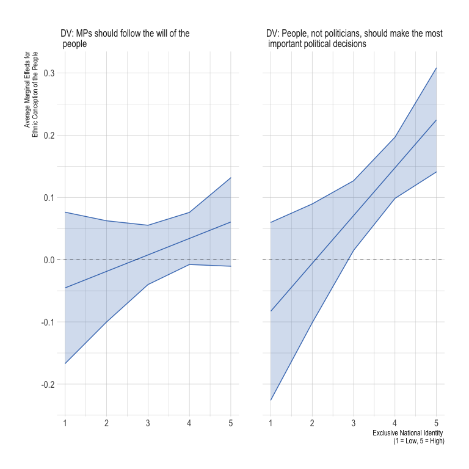
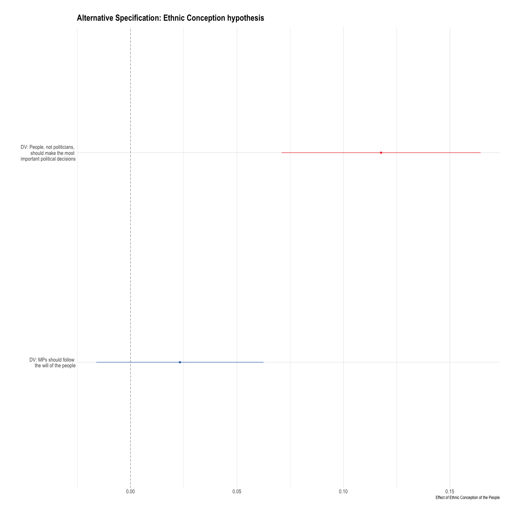
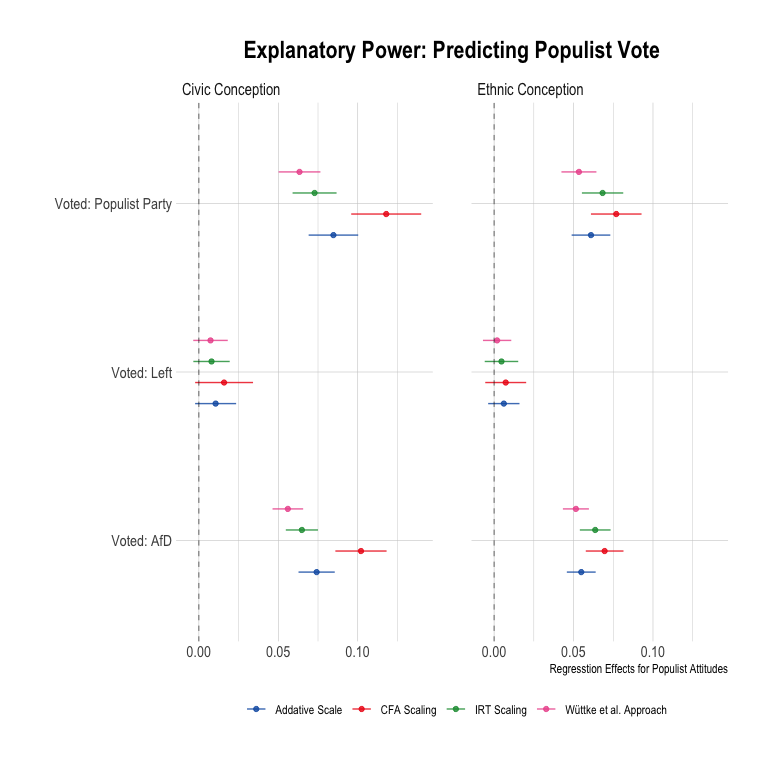
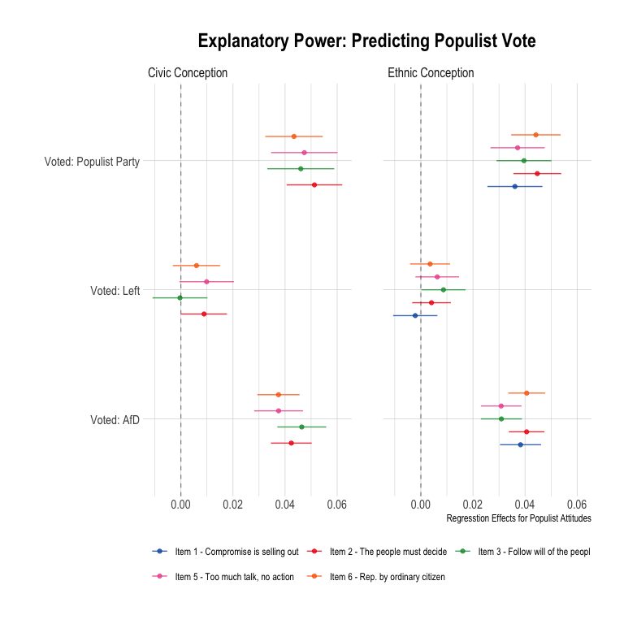

Analyses
================

# Scripts

# Required Packages & Reproducibility

``` r
rm(list=ls())
source(here::here("src/lib/functions.R"))
```

# Pre-Registered Analyses

``` r
load(here("data/intermediate/cleaned_experiment.RData"))
source(here("src/analysis/data-for-analyses.R"))
```

Next, we automatically extract a `.md` file for the online appendix, as
well as a latex table for the manuscript. We are using jinja2 template
[src/analysis/table_descriptives.tex.j2](table.tex.j2) which is called
with a json string containing the data. To replicate, make sure
`env/bin/pip install -U j2cli` is installed via your command line.

``` r
source(here("src/analysis/descriptive-information-overview.R"))
table2 <- knitr::kable(descr, digits=2)
fn <- here("report/figures/table_descriptives.tex")
cat("# Table: Descriptive Information of Variables under Study \n\n", file=fn)
cat(table2, file=fn, sep="\n", append=T)

methodnames <- setNames(as.list(descr$Variables), descr$Variables)
table <- purrr::map(descr, .f= ".") 
#render_j2(here("src/analysis/table_descriptives.tex.j2"), here("report/figures/table_descriptives.tex"),
#          data=list(data=table, methods=methodnames))
rm(descr, methodnames, table, fn, table2)
```

## Descriptive Results


## Balance Checks

The figure below shows that the data is unbalanced for the variables:
`Education`,`Income`, `Employment`, `Urbaness`, `Living Place`,
`Birth Place`, `Age`, `Political Knowledge`, `Political Interest`, and
`Ideology`. As described in the Pre-Analysis Plan (p.10), I will add
these covariates to the analyses as controls.

``` r
source(here("src/analysis/balance-test.R"))
df
```


## Ethnic Conception Hypothesis

``` r
source(here("src/analysis/h1.R"))
p1
```


``` r
# negative values: Ethnic conception > Civic conception 
# positive values: Ethnic conception < Civic conception 
```

## National Identity Hypothesis

``` r
source(here("src/analysis/h2a.R"))
p2a
```



## Far Right Party ID Hypothesis

``` r
source(here("src/analysis/h2b.R"))
p2b
```


# Exploration

## Alternative specifications + Interactions

``` r
source(here("src/analysis/explorative_analysis.R"))
pe1 
```



``` r
pe3/ (pe4 + pe5) #add pe2 (age)
```


## Scaling fit

### CFA

``` r
source(here("src/analysis/explorative_cfa.R"))

kbl(m_cfa, booktabs =T, caption = "Confirmatory Factor Analysis - Fit Statistics") %>%
  kable_styling(latex_options = c("striped", "hold_position"),
                full_width = F, fixed_thead = T, position = "center") %>%
  column_spec(1, width = "4cm") %>%
  column_spec(2, width = "4cm")  %>%
  column_spec(2, width = "4cm") %>%
  column_spec(2, width = "4cm") 
```

<table class="table" style="width: auto !important; margin-left: auto; margin-right: auto;">
<caption>
Confirmatory Factor Analysis - Fit Statistics
</caption>
<thead>
<tr>
<th style="text-align:left;position: sticky; top:0; background-color: #FFFFFF;">
Fit Statistics
</th>
<th style="text-align:right;position: sticky; top:0; background-color: #FFFFFF;">
Ethnic Conception
</th>
<th style="text-align:right;position: sticky; top:0; background-color: #FFFFFF;">
Civic Conception
</th>
<th style="text-align:right;position: sticky; top:0; background-color: #FFFFFF;">
Civic Conception (6 Items)
</th>
</tr>
</thead>
<tbody>
<tr>
<td style="text-align:left;width: 4cm; ">
CFI
</td>
<td style="text-align:right;width: 4cm; width: 4cm; width: 4cm; ">
0.99
</td>
<td style="text-align:right;">
0.99
</td>
<td style="text-align:right;">
0.98
</td>
</tr>
<tr>
<td style="text-align:left;width: 4cm; ">
AIC
</td>
<td style="text-align:right;width: 4cm; width: 4cm; width: 4cm; ">
44106.68
</td>
<td style="text-align:right;">
43468.92
</td>
<td style="text-align:right;">
52011.91
</td>
</tr>
<tr>
<td style="text-align:left;width: 4cm; ">
BIC
</td>
<td style="text-align:right;width: 4cm; width: 4cm; width: 4cm; ">
44180.07
</td>
<td style="text-align:right;">
43542.37
</td>
<td style="text-align:right;">
52097.61
</td>
</tr>
<tr>
<td style="text-align:left;width: 4cm; ">
RMSEA
</td>
<td style="text-align:right;width: 4cm; width: 4cm; width: 4cm; ">
0.06
</td>
<td style="text-align:right;">
0.08
</td>
<td style="text-align:right;">
0.08
</td>
</tr>
<tr>
<td style="text-align:left;width: 4cm; ">
p-value RMSEA
</td>
<td style="text-align:right;width: 4cm; width: 4cm; width: 4cm; ">
0.16
</td>
<td style="text-align:right;">
0.00
</td>
<td style="text-align:right;">
0.00
</td>
</tr>
<tr>
<td style="text-align:left;width: 4cm; ">
SRMR
</td>
<td style="text-align:right;width: 4cm; width: 4cm; width: 4cm; ">
0.01
</td>
<td style="text-align:right;">
0.02
</td>
<td style="text-align:right;">
0.03
</td>
</tr>
</tbody>
</table>

``` r
kbl(cfa1, booktabs =T, caption = "Confirmatory Factor Analysis") %>%
  kable_styling(latex_options = c("striped", "hold_position"),
                full_width = F, fixed_thead = T, position = "center") %>%
  column_spec(1, width = "10cm") %>%
  column_spec(2, width = "3cm") 
```

<table class="table" style="width: auto !important; margin-left: auto; margin-right: auto;">
<caption>
Confirmatory Factor Analysis
</caption>
<thead>
<tr>
<th style="text-align:left;position: sticky; top:0; background-color: #FFFFFF;">
Variables
</th>
<th style="text-align:right;position: sticky; top:0; background-color: #FFFFFF;">
Values
</th>
</tr>
</thead>
<tbody>
<tr>
<td style="text-align:left;width: 10cm; ">
Average of PCA Constructed Scale for Civic Conception of the People
</td>
<td style="text-align:right;width: 3cm; ">
-0.02
</td>
</tr>
<tr>
<td style="text-align:left;width: 10cm; ">
Average of PCA Constructed Scale for Ethnic Conception of the People
</td>
<td style="text-align:right;width: 3cm; ">
0.01
</td>
</tr>
<tr>
<td style="text-align:left;width: 10cm; ">
Average of Civic Conception - Average of Ethnic Conception
</td>
<td style="text-align:right;width: 3cm; ">
-0.02
</td>
</tr>
<tr>
<td style="text-align:left;width: 10cm; ">
p-Value for Differences in Means
</td>
<td style="text-align:right;width: 3cm; ">
0.11
</td>
</tr>
</tbody>
</table>

``` r
cfa2
```


### Additive scale

``` r
source(here("src/analysis/additive-scale.R"))

kbl(add1, booktabs =T, caption = "Confirmatory Factor Analysis") %>%
  kable_styling(latex_options = c("striped", "hold_position"),
                full_width = F, fixed_thead = T, position = "center") %>%
  column_spec(1, width = "10cm") %>%
  column_spec(2, width = "3cm")  

add2
```

### Wüttke et al. Approach

``` r
source(here("src/analysis/wuttke-approach.R"))

kbl(wa1, booktabs =T, caption = "Confirmatory Factor Analysis") %>%
  kable_styling(latex_options = c("striped", "hold_position"),
                full_width = F, fixed_thead = T, position = "center") %>%
  column_spec(1, width = "10cm") %>%
  column_spec(2, width = "3cm")  

wa2
```

### IRT Analyse

``` r
source(here("src/analysis/IRT.R"))
```

``` r
irt1 + irt2 + 
  plot_layout(widths = c(1, 2))
```


## Explanatory Power: Predicting Populist Vote

``` r
source(here("src/analysis/predict-pop-vote-scales.R"))
exp
```



``` r
source(here("src/analysis/predict-pop-vote-items.R"))
exp
```


